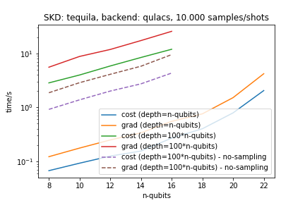
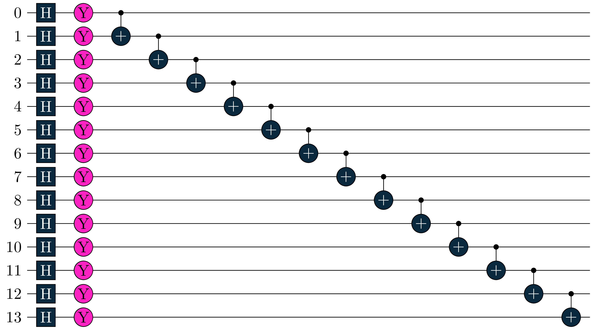

Small Benchmark on shot-based evaluation of primiitive cost functions (all-Z in Hamiltonian)
- SDK: [tequila](https://github.com/tequilahub/tequila) ran with version 1.7.0
- Backend: [qulacs](https://github.com/qulacs/qulacs) ran with version 0.3.0
Ran on Dell XPS 15 from 2019: Intel(R) Core(TM) i5-8265U CPU @ 1.60GHz  

Measurement is a single all-z Paulistring and one layer of the circuit (here for 8 qubits) looks like:

 

gradient is w.r.t a single parameter (randomly chosen) - whitnessed by the factor 2 difference in runtime compared to the regular cost function (shift-rule)
